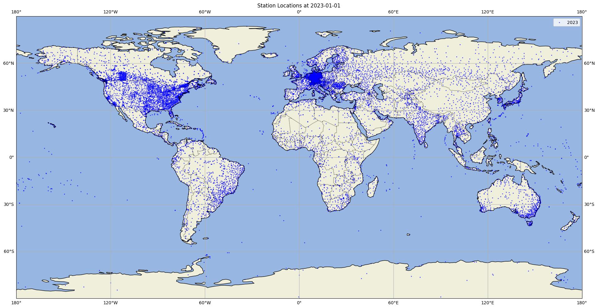
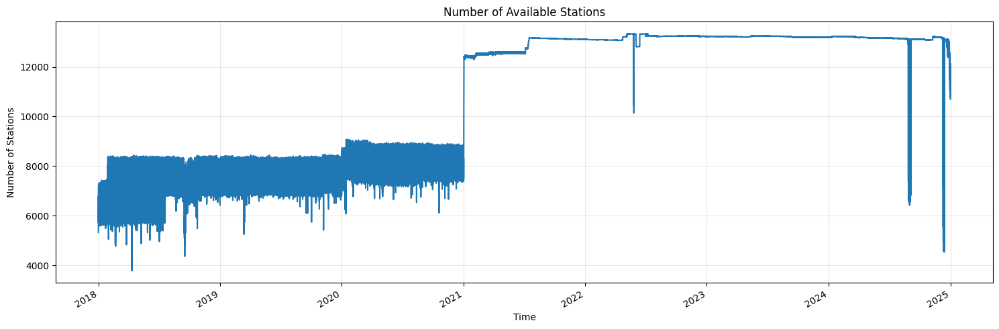

# StationBench

StationBench is a Python library for benchmarking weather forecasts against weather station data. It provides tools to calculate metrics, visualize results, and compare different forecast models.

## Features

- Calculate RMSE and other metrics between forecasts and ground truth data
- Support for multiple weather variables (temperature, wind speed, solar radiation)
- Regional analysis capabilities (Europe, North America, Global, etc.)
- Integration with Weights & Biases for experiment tracking

## Benchmarking data

The provided benchmarking data is a subset of the [Meteostat](https://dev.meteostat.net/) dataset. It contains weather data from 2018-2024 for 10m wind speed and 2m temperature. The data is provided by the following organizations:
- Deutscher Wetterdienst
- NOAA
- Government of Canada
- MET Norway
- European Data Portal
- Offene Daten Österreich

Source: [Meteostat](https://dev.meteostat.net/) ([CC BY-NC 4.0](https://creativecommons.org/licenses/by-nc/4.0/legalcode))


The benchmarking data can be accessed from `ADD_DATA_PATH`.





## Installation

Using poetry:
```bash
poetry install
```

## Quick Start

```python
from stationbench.calculate_metrics import generate_benchmarks
import xarray as xr

# Load your forecast and ground truth data
forecast = xr.open_zarr("path/to/forecast.zarr")
ground_truth = xr.open_zarr("path/to/ground_truth.zarr")

# Calculate metrics
benchmarks = generate_benchmarks(
    forecast=forecast,
    ground_truth=ground_truth
)
```

For more detailed examples, see the [examples directory](./examples).

## Command Line Usage
```bash
poetry run python stationbench/calculate_metrics.py \
    --forecast_loc forecast.zarr \
    --ground_truth_loc ground_truth.zarr \
    --start_date 2023-01-01 \
    --end_date 2023-12-31 \
    --output_loc forecast-rmse.zarr \
    --region europe \
    --name_10m_wind_speed "10si" \
    --name_2m_temperature "2t"
```

## Data Format Requirements

### Forecast Data
- Must include dimensions: latitude, longitude, time
- Variables should include:
  - 10m_wind_speed (or custom name)
  - 2m_temperature (or custom name)
  - ssrd (or custom name)

### Ground Truth Data
- Must include dimensions: station_id, time
- Must include coordinates: latitude, longitude

## Documentation

Full documentation is available in the [docs/](./docs/) directory:
- [Getting Started Guide](docs/getting-started.md)
- [Examples](docs/examples.md)

## Contributing

We welcome contributions! Please see our [CONTRIBUTING.md](CONTRIBUTING.md) for details.

## License

This project is licensed under the MIT License - see the [LICENSE](LICENSE) file for details.
